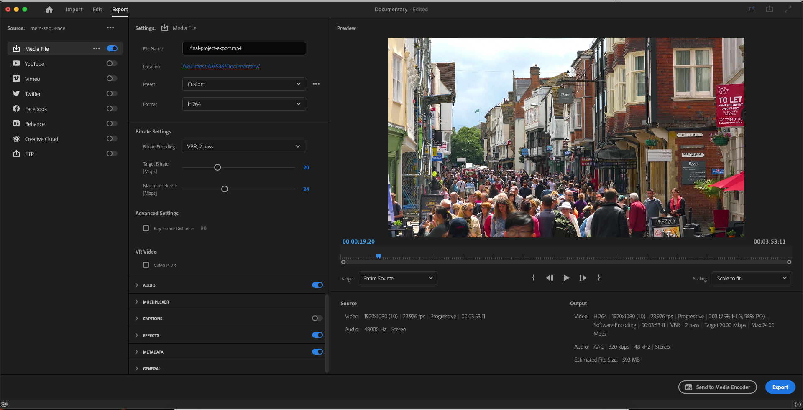

# Exporting an MP4

You’ll export an **MP4** file as your finished product. You can upload this **MP4** file to YouTube.

## EXPORTING DECEMBER 2025

1. **Important**: Make sure the **Timeline** panel is selected before exporting your video. To select the **Timeline** panel, click within **Timeline** panel. When selected, the **Timeline** panel will have a blue border around it.&#x20;
2. Go to **File** on the menu bar. Select **Export**. From the fly-out menu, select **Send to Adobe Media Encoder**. **Media Encoder** will open.
3. In **Media Encoder**, control-click **H.264** in the **Queue** area in the upper-right. Select **Export Settings**.
4. In the **Export Settings** box, change the **Preset** to **High Quality 1080p HD**.&#x20;
5. In the **Output Name** area, click the name of the **MP4** file. Rename the **MP4** file and confirm that the file will export to your **project folder**.
6. Click **OK** (lower-right.) The **Export Settings** box will close.&#x20;
7. In **Media Encoder**, click the **Play** button (upper-right) to begin the export process.&#x20;

## Normal quality MP4 (faster encode time)

1. **Important**: Make sure the **Timeline** panel selected before exporting your video. To select the **Timeline** panel, click within **Timeline** panel. When selected, the **Timeline** panel will have a blue border around it.&#x20;
2. Go to **File** on the menu bar. Select **Export**. From the fly-out menu, select **Media**. The **Export** dialog box will appear.
3. In the **File Name** field, enter a name for your exported file.
4. In the **Location** area, click the **blue hyperlink** to the set the location for the exported file. If necessary, n[avigate to and select your project folder](https://jjloomis.gitbook.io/file-and-folder-management-mac-os-edition/navigating-folder-tree).
5. In the **Preset** drop-down list, select **High Quality 1080p HD**.
6. In the **Format** drop-down list, select **H.264**. **Note:** **Do not** select **H.264 Blueray**.
7. In the **Range** drop-down list (beneath video preview), select **Entire Sequence**.
8. Click **Export**.

## High quality MP4 (longer encode time)

1. **Important**: Make sure the **Timeline** panel selected before exporting your video. To select the **Timeline** panel, click within **Timeline** panel. When selected, the **Timeline** panel will have a blue border around it.&#x20;
2. Go to **File** on the menu bar. Select **Export**. From the fly-out menu, select **Media**. The **Export** dialog box will appear.
3. In the **File Name** field, enter a name for your exported file.
4. In the **Location** area, click the **blue hyperlink** to the set the location for the exported file. If necessary, n[avigate to and select your project folder](https://jjloomis.gitbook.io/file-and-folder-management-mac-os-edition/navigating-folder-tree).
5. In the **Preset** drop-down list, select **High Quality 1080p HD**.
6. In the **Format** drop-down list, select **H.264**. **Note:** **Do not** select **H.264 Blueray**.
7. In the **Video** section, click the **chevron** icon to see all available **Video** settings.
8. In the **Video** section, scroll down to **Bitrate Settings**. In the **Bitrate Encoding** drop-down list, choose **VBR, 2 pass**.
9. In the **Range** drop-down list (beneath video preview), select **Entire Sequence**.
10. Click **Export**.

