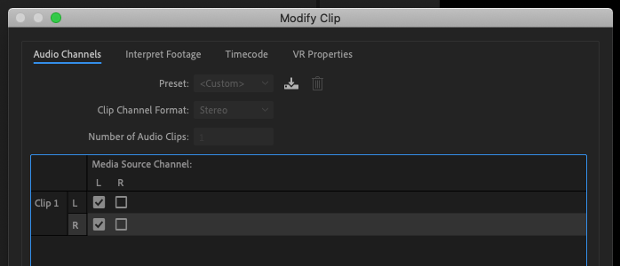
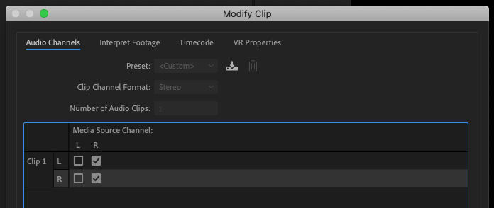

# Centering audio channels

1. In your sequence, press **Control** and click a clip.
2. In the fly-out menu, choose Audio Channels.
3. In the Modify Clip dialog box, select the Audio Channels tab.
4. In the Media Source Channel panel, select the correct channels to center your audio. See images below for correct settings.

<figure><figcaption>
Handheld mic, lavalier mic, or mult box clip settings.
</figcaption></figure>

<figure><figcaption>
Shotgun mic channel clip settings.
</figcaption></figure>
